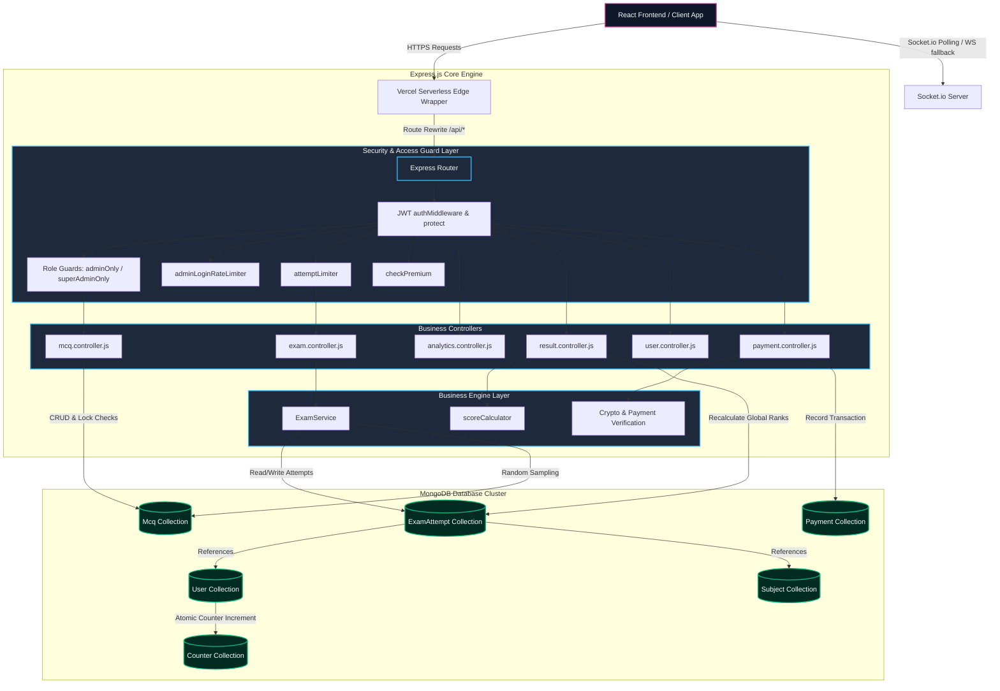
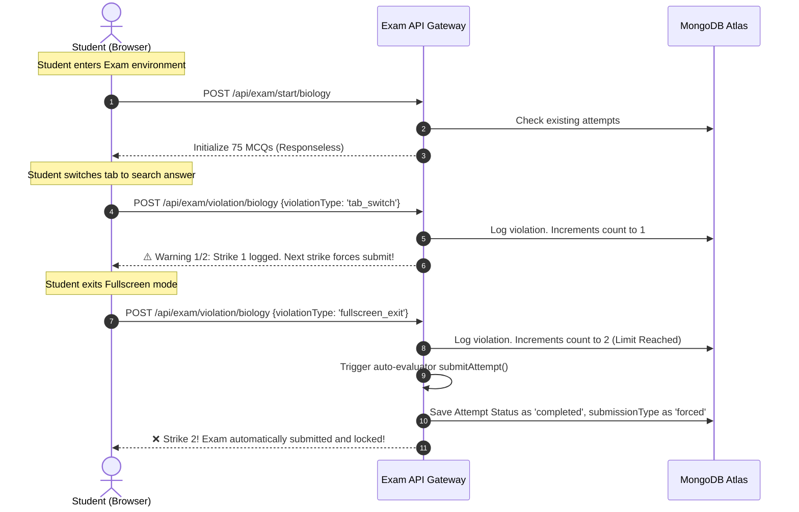

# MDCAT SaaS Platform - Backend Architecture & Technical Guide

Welcome to the definitive backend architecture documentation for the **MDCAT Testing Platform Backend**. This system is built using standard Node.js, Express, Mongoose (MongoDB), and Socket.io, optimized for deployment on Vercel's Serverless environment.

This document serves as an exhaustive, technical blueprint detailing every database schema, route, middleware, business logic engine, and system integration within this application.

---

## 🗺️ System Architecture & Data Flow

Below is the conceptual architecture of the MDCAT backend, showcasing how a client interacts with the server, how security rules are applied, and how data flows through the various application layers.



---

## 🗄️ Database Schemas & Data Models

The system has **8 core collections** modeled via Mongoose. Every document utilizes strict typing, input validation, and automatic timestamps.

### 1. `User` Schema ([User.js](file:///f:/Backend/Real%20Project/backend/src/models/User.js))
Manages identities, roles, premium subscription states, multi-factor authentication metadata, and MDCAT registration details.
*   **Key Fields**:
    *   `name`: (String, required) Full name of the user.
    *   `email`: (String, required, unique) Standard email format matching validation.
    *   `password`: (String, select: false) Hashed via Bcrypt with 10 salt rounds (never returned in standard queries).
    *   `role`: (String, enum: `['student', 'admin', 'superAdmin']`, default: `student`).
    *   `subscriptionStatus`: (String, enum: `['free', 'premium']`, default: `free`).
    *   `isPremium`: (Boolean, default: `false`) Enforces premium gatekeeper access.
    *   `premiumExpiry`: (Date, default: `null`) Timestamp indicating subscription expiration.
    *   `rollNumber`: (String, unique, sparse, indexed) Format: `MDCATYYYY-SEQ` (e.g. `MDCAT2026-0001`). Sparse index allows migration compatibility.
    *   `registrationYear`: (Number) The year of roll number registration.
    *   `examProgress`: (Mixed, default: `{}`) Tracks dynamic client state.
    *   `isEmailVerified` & `twoFactorEnabled`/`twoFactorSecret`: Foundations for advanced verification workflows.
*   **Hooks**:
    *   `pre('save')`: Hashes password on user creation or modification.
*   **Instance Methods**:
    *   `matchPassword(enteredPassword)`: Compares entered plain-text password with hashed database password.

### 2. `Subject` Schema ([Subject.js](file:///f:/Backend/Real%20Project/backend/src/models/Subject.js))
Represents the subjects/categories available for testing (Biology, Chemistry, Physics, Mathematics).
*   **Key Fields**:
    *   `name`: (String, required, unique, trimmed) e.g., "Biology".
    *   `slug`: (String, required, unique, lowercase) e.g., "biology".
    *   `icon`: (String, default: "BookOpen") String representation of Lucide/FontAwesome icon for frontend dynamic rendering.
    *   `description`: (String, default: "") Subject introduction.
    *   `isActive`: (Boolean, default: `true`).

### 3. `Mcq` Schema ([Mcq.js](file:///f:/Backend/Real%20Project/backend/src/models/Mcq.js))
Represents a Multiple Choice Question (MCQ). Features compound indexing for high-frequency queries.
*   **Key Fields**:
    *   `question`: (String, required, trimmed).
    *   `options`: (Array of 4 Strings, required) Validated by custom validator `arrayLimit` to contain precisely 4 options.
    *   `correctOptionIndex`: (Number, required, min 0, max 3) Zero-indexed answer locator.
    *   `subject`: (ObjectId, ref: `Subject`, required) Reference to the parent subject.
    *   `chapter`: (String, required, trimmed) Chapter subdivision for taxonomy filters.
    *   `difficulty`: (String, enum: `['easy', 'medium', 'hard']`, default: `medium`).
    *   `explanation`: (String, default: "No explanation provided.").
    *   `tags`: (Array of Strings) e.g., `["Genetics", "MDCAT-2025"]`.
    *   `status`: (String, enum: `['draft', 'reviewed', 'published', 'archived', 'active', 'inactive']`, default: `draft`).
    *   `createdBy`: (ObjectId, ref: `User`) Reference to the admin who created the question.
*   **Indexes**:
    *   Compound index `{ subject: 1, difficulty: 1, status: 1 }` (optimizes randomized aggregation sampling).
    *   Compound index `{ subject: 1, chapter: 1 }` (optimizes taxonomy/chapter queries).

### 4. `ExamAttempt` Schema ([ExamAttempt.js](file:///f:/Backend/Real%20Project/backend/src/models/ExamAttempt.js))
Logs a student's active or completed exam attempt for a specific subject. Only one attempt is permitted per student per subject.
*   **Key Fields**:
    *   `user`: (ObjectId, ref: `User`, required).
    *   `subject`: (ObjectId, ref: `Subject`, required).
    *   `attemptStatus`: (String, enum: `['in_progress', 'completed', 'expired']`, default: `in_progress`).
    *   `isFreeTrial`: (Boolean, default: `false`) Flags if the attempt was a 3-question free trial.
    *   `responses`: Array of objects tracking:
        *   `mcq`: (ObjectId, ref: `Mcq`).
        *   `selectedOptionIndex`: (Number, default: `-1`).
        *   `isCorrect`: (Boolean, default: `false`).
        *   `timeSpent`: (Number, default: 0) Seconds spent on this specific question.
    *   `score` / `percentage` / `correctAnswers` / `incorrectAnswers` / `skippedQuestions`: Real-time score summaries.
    *   `timeTaken`: (Number, default: 0) Total cumulative seconds spent on the exam.
    *   `difficultyDistribution`: Objects tracking correct answers broken down by `{ easy, medium, hard }`.
    *   `violationCount`: (Number, default: 0) Counts detected cheating violations.
    *   `submissionType`: (String, enum: `['manual', 'auto', 'forced']`, default: `manual`) `forced` flags a proctor-submitted attempt.
    *   `violations`: Array of objects tracking:
        *   `violationType`: (String, enum: `['tab_switch', 'fullscreen_exit', 'copy_paste', 'right_click', 'window_blur']`).
        *   `timestamp`: (Date).
    *   `isPublished`: (Boolean, default: `false`) Result leakage prevention flag.
    *   `publishDate`: (Date, default: `null`) Date of official result release.
    *   `rank` & `percentile`: (Numbers) Ranks calculated relative to other test takers upon official release.
*   **Indexes**:
    *   **Strict Compound Index**: `{ user: 1, subject: 1 }` with `{ unique: true }` enforcing the single-attempt constraint.
    *   Sorting index: `{ percentage: -1 }` for leaderboard aggregation.

### 5. `Result` Schema ([Result.js](file:///f:/Backend/Real%20Project/backend/src/models/Result.js))
*Legacy/Alternative engine model* tracking attempts for static, predefined mock exams. Implements a compound index `{ user: 1, test: 1 }` with `{ unique: true }`.

### 6. `Payment` Schema ([Payment.js](file:///f:/Backend/Real%20Project/backend/src/models/Payment.js))
Tracks premium subscription invoice states and transaction codes.
*   **Key Fields**:
    *   `user`: (ObjectId, ref: `User`, required).
    *   `amount`: (Number, required) Cost of membership.
    *   `method`: (String, enum: `['Razorpay', 'JazzCash', 'Easypaisa']`, required).
    *   `status`: (String, enum: `['pending', 'completed', 'failed']`, default: `pending`).
    *   `transactionId`: (String, unique, sparse).

### 7. `Counter` Schema ([Counter.js](file:///f:/Backend/Real%20Project/backend/src/models/Counter.js))
An auxiliary helper collection for atomic sequencing operations, specifically used by MongoDB to generate continuous, padded sequential numbers for roll numbers without concurrency conflicts.

---

## 🛡️ Guard & Middleware System

A critical aspect of this backend is its multi-layered middleware architecture, designed to filter requests and protect sensitive endpoints.

### 🔑 `authMiddleware` / `protect` ([roleAuth.js](file:///f:/Backend/Real%20Project/backend/src/middleware/roleAuth.js))
Decodes incoming JWT Bearer tokens from the `Authorization` header. If the token has expired, it triggers a custom `TokenExpiredError` response (401 Unauthorized), which prompts the frontend to clear credentials and redirect.

### 🚦 `adminOnly` & `superAdminOnly` ([roleAuth.js](file:///f:/Backend/Real%20Project/backend/src/middleware/roleAuth.js))
Restricts route access by checking the role attached to `req.user`. If the user is a `student` trying to hit admin paths, it blocks the request with a **403 Forbidden** error.

### 🔒 `attemptLimiter` ([attemptLimiter.js](file:///f:/Backend/Real%20Project/backend/src/middleware/attemptLimiter.js))
Intercepts exam entry requests. It verifies if an existing `ExamAttempt` has been finalized. If `attemptStatus === 'completed'`, it blocks re-entry with a **403 Forbidden**. If a free user completes their 3-question trial, this middleware locks the exam and prompts them to subscribe.

### ⚡ `checkPremium` ([premium.js](file:///f:/Backend/Real%20Project/backend/src/middleware/premium.js))
Gatekeeper for premium mock exams. Admins are auto-authorized. For standard students, it checks if `isPremium === true` and whether the current date has exceeded `premiumExpiry`.

### 🛡️ `adminLoginRateLimiter` ([rateLimiter.js](file:///f:/Backend/Real%20Project/backend/src/middleware/rateLimiter.js))
An in-memory security layer protecting admin login credentials. It restricts IP addresses to a maximum of **5 login attempts per 15 minutes**. When exceeded, it blocks the IP and returns a **429 Too Many Requests** error.

---

## 🧠 Core Feature Engines (The Crown Jewels)

### 1. The Anti-Cheating & Automated Proctorship Engine
To maintain high academic integrity, the platform features a real-time proctorship subsystem.



*   **Strike Logic**: Students get exactly **one warning**. Upon the **second violation** (e.g., exiting fullscreen or switching tabs), the backend triggers `submitAttempt` with `submissionType: 'forced'`, locking the exam immediately.

---

### 2. Result Leakage Prevention & Scheduled Release System
Designed to prevent academic answers from leaking during an active exam window.

*   **Dynamic Response Stripping**: When an exam is started or resumed, `ExamService` retrieves random MCQs using an aggregation sample. It strips `correctOptionIndex` and `explanation` from the payload sent to the client, preventing students from inspecting the network tab to find answers.
*   **Result Obfuscation**: When students submit their exam, the server calculates their score and logs it, but returns a generic `pending` status.
*   **Student Results Gateway**: The `getMyResults` controller strips scores, statistics, and answers from any attempt where `isPublished === false`. Students only see their completion timestamp and scheduled release date until the results are officially announced.
*   **Global Rank & Percentile Calculation**: When results are published, the backend executes a recalculation routine:
    $$\text{Percentile} = \left( \frac{\text{Total Participants} - \text{Global Rank}}{\text{Total Participants}} \right) \times 100$$
    This provides an accurate relative rank for every student.
*   **Auto-Publish Engine**: A background worker in `server.js` polls every 60 seconds. Any exam with a passed `publishDate` is automatically published, ranks are recalculated, and real-time alerts are broadcast to connected users.

---

### 3. Graceful Socket.io Serverless Fallback
Standard WebSockets require persistent connections, which are not supported in serverless architectures like Vercel. 

*   **Mock Fallback**: In `sockets/index.js`, the system checks if the `socket.io` instance has been initialized. If running in a serverless environment that lacks a persistent socket server, it returns a mock emitter to prevent execution crashes.
*   **Fallback Endpoint**: A dedicated polling endpoint `GET /api/results/latest-status` is provided. The frontend can query this endpoint using a fallback intervals method to receive real-time result announcements without connection errors.

---

## 🚀 Vercel Serverless Optimizations ([api/index.js](file:///f:/Backend/Real%20Project/backend/api/index.js))

The server uses a custom entry point designed to handle Vercel Serverless limitations:
1.  **Immediate CORS Attachment**: CORS headers are attached directly to the Vercel Response object at the entry point, ensuring preflight `OPTIONS` requests succeed without waiting for database connections or server boots.
2.  **Fast Interception**: `OPTIONS` requests are intercepted immediately and returned with a `200 OK`, preventing 504 timeouts.
3.  **Database Connection Pooling**: Uses a global variable `dbConnected` to cache and reuse the Mongoose connection across serverless invocations, reducing cold starts.

---

## 🛠️ Utility Scripts & Migrations

### A. Roll Number Generator ([rollNumberGenerator.js](file:///f:/Backend/Real%20Project/backend/src/utils/rollNumberGenerator.js))
Uses MongoDB atomic updates to generate structured roll numbers for new users:
```javascript
const counter = await Counter.findOneAndUpdate(
  { id: 'rollNumber' },
  { $inc: { seq: 1 } },
  { new: true, upsert: true }
);
```
Generates formatted strings (e.g., `MDCAT2026-0015`) to ensure a sequential registration history.

### B. Subject Migrator ([migrateSubjects.js](file:///f:/Backend/Real%20Project/backend/migrateSubjects.js))
Seeds the core subjects (Biology, Chemistry, Physics, Mathematics) and updates older, string-based database schemas to use proper `ObjectId` references.

---

## 💡 Key Architectural Strengths

1.  **Secure Aggregations**: Uses MongoDB aggregates (`$group`, `$lookup`, `$unwind`) to compute subject distributions and student stats in single database calls, reducing memory usage.
2.  **Double-Shielded Single Attempt Enforcement**: Combining unique database indexes with application-level middleware guards ensures users cannot submit duplicate attempts.
3.  **Self-Healing Schema Migrations**: The MCQ routing system automatically converts any legacy string subjects to proper ObjectIds at runtime, preventing system crashes.
4.  **Optimized Indexes**: Compounds indexes on high-frequency search fields (`subject`, `difficulty`, `status`) ensure fast search response times even as the database grows.
